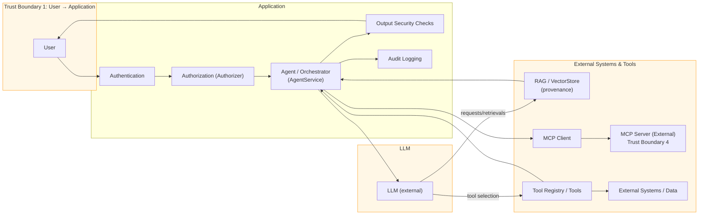

# secure-ai-agent-platform

A Python-based secure AI agent reference implementation. It demonstrates how to build and harden an LLM application with:

- RAG (retrieval-augmented generation)
- Agent orchestration and tool calling
- MCP client/server integration
- Application-level authentication, authorization, and audit
- Provenance and RAG poisoning defenses

This repository is a security-focused reference implementation for engineering review and interviews — not a production deployment.

## AI Security Architecture

See `docs/AI_SECURITY.md` for the full consolidated security architecture, threat model, control matrix, responsibilities, least-privilege guidance, defense-in-depth, attack-path examples, and checklist.

### Quick Setup

1. Create and activate a Python 3.9+ virtual environment.
2. Install dependencies:

```bash
python3 -m pip install -r requirements.txt
```

3. Copy the example env and edit for local testing:

```bash
cp .env.example .env
# edit .env and set LLM_API_KEY or PROVIDER_URL as needed
```

4. Run tests:

```bash
python3 -m pytest -q
```

### Security Testing

This project follows a build→test→attack→harden→retest loop. Security tests use synthetic data and controlled, harmless attack simulations (prompt-injection, RAG poisoning, unauthorized tool calls). See `tests/` and `docs/AI_SECURITY.md`.

### Architecture Diagram (control + data flow)



### Threat / Control / Test Matrix

See `docs/AI_SECURITY.md` for the implemented controls and test mapping. The implemented security tests are in the `tests/` folder and cover prompt injection, indirect prompt injection (RAG), tool authorization, argument validation, RAG provenance handling, and MCP security scenarios.

### Security Scope

This repository is a reference implementation intended for engineering review and demonstration. It intentionally implements controls for common AI-application threats but does not claim production-grade deployment hardening (e.g., enterprise identity integrations, centralized secrets management, mTLS, runtime sandboxes, SIEM integration). See `docs/AI_SECURITY.md` for details.

